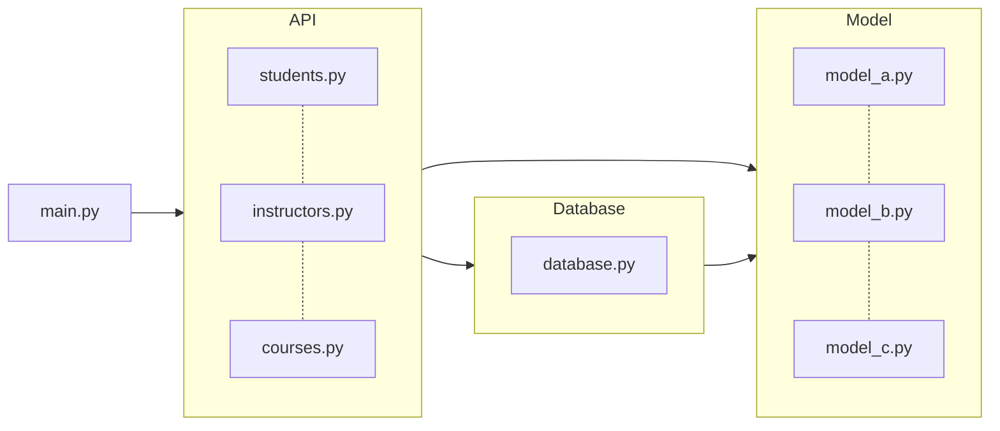

# 🌐LessonLink: Link student and Academy


학습자와 교육자 간의 연결을 강화하고 다양한 강의와 학습 자료에 접근할 수 있게 하여 학습 경험을 혁신하는 교육 솔루션

## :bulb:서비스 및 프로젝트 소개
**`LessonLink`**는 학습자와 교육자 간의 연결을 강화하여 학습 경험을 혁신하는 교육 솔루션입니다. 학습자들에게 다양한 강의와 학습 자료를 제공하고, 교육자들은 자신의 강의를 등록하고 관리할 수 있습니다. 여러 학원이 참여하여 학습자들이 다양한 교육 기관의 강의를 선택할 수 있으며, 원활한 소통과 일정 관리 기능을 통해 효율적인 학습 환경을 제공합니다.

프로젝트 진행시 CS 이론을 항상 코드에 접목시키려고 노력하고 있으며, 다음과 같은 질문을 던지며 진행중에 있습니다.

1. 사용성을 더욱 개선시킬 수 없을까?
2. 대용량 트래픽에도 안정적인가?
3. 확장에 용이하며 유지보수가 쉬운가?

## :mag: 중점 과제
#### 1. 기능구현에만 집중하지 않기
- 빠르게 구현하는 것보다 더 중요한 것이 작성하는 코드나 사용하는 기술을 `정확하게` 알고 사용하는 것이라고 생각합니다.
- 새로운 기술을 적용할 때 해당 기술에 대한 학습도 함께 진행하여 기초를 튼튼히 세워 적재적소에 필요한 기능을 배치하고, 필요하면 응용도 할 수 있는 능력을 키우고자 합니다.
- 작성하는 코드는 단순히 `복사 붙여넣기`만 하는 것이 아니라 왜 이 코드를 사용하는지, 원리는 어떻게 되는지, 장단점은 어떻게 되며 어떤 Trade-off 관계가 있는지 깊이 생각하고 이해함으로써 완전히 내것으로 만들 수 있도록 노력하고자 합니다.

#### 2. 눈에 보이는 화려한 기술보다는 간단하더라도 깊게
- 당장에 눈에 보이는 광범위한 서비스나 화려한 기술보다는 단순하게 게시판, 로그인 등을 구현하더라도 이론을 바탕으로 안정적이고 빠른 서비스를 구축하는 편이 더 낫다고 생각합니다.
- 안정적이고 빠르게 작동하는 기본 기능은 전체 시스템의 신뢰성을 높이며, 사용자 경험을 향상시킵니다. 기본 기능이 완성도가 높아야 추가적인 고급 기능도 제대로 구현될 수 있다고 생각합니다.
- 단순한 기능을 깊이 있게 구현하면 개발자의 문제 해결 능력이 향상됩니다. 이는 복잡한 문제를 만났을 때 더 효과적으로 대응할 수 있는 능력을 배양하게 됩니다.

#### 3. 대용량 트래픽을 염두에 두기
- 프로젝트의 최종 목표는 `대용량 트래픽 속에서도 빠르고 안정적인 서비스`를 만드는 법을 배우는 것입니다.
- 따라서, 항상 `다수의 트래픽을 기본 전제`로 하여 섬세하게 설계해 나가고자 합니다. 

## :rocket: 사용 기술
- [Python 3.10.12](https://docs.python.org/release/3.10.12/)
- [MySQL 8.0](https://dev.mysql.com/doc/refman/8.0/en/)
- [Redis](https://redis.io/documentation)
- [docker](https://docs.docker.com/)

### Pre-requisites

- Python 3.11 or higher
- [Poetry](https://python-poetry.org/docs/#installation)

### Install dependencies

```bash
make install
```

## How to run

```bash
make run
```

## Environment variables

환경 변수를 지정하여 구성 값을 조정할 수 있습니다.

| Name | Description             | Default                  |
| --- |-------------------------|--------------------------|
| `WEB_HOST` | Web server host         | `0.0.0.0`                |
| `WEB_PORT` | Web server port         | `8000`                   |
| `DATABASE_URL` | Database SQLAlchemy URL | `sqlite:///./db.sqlite3` |
| `DATABASE_ECHO` | Database echo flag      | `True`                   |
| `CORS_ORIGINS` | CORS origins            | `*`                      |
| `CORS_CREDENTIALS` | CORS credentials flag   | `True`                   |
| `CORS_METHODS` | CORS methods            | `*`                      |
| `CORS_HEADERS` | CORS headers            | `*`                      |

앱은 `.env` 파일 또한 지원합니다.
다음처럼 프로젝트 최상단 경로에 `.env` 파일을 작성하여 필요한 환경 변수를 로드할 수 있습니다.

```bash
# .env

WEB_HOST="0.0.0.0"
WEB_PORT="8000"
DATABASE_URL="sqlite:///./db.sqlite3"
DATABASE_ECHO="True"
CORS_ORIGINS="*"
CORS_CREDENTIALS="True"
CORS_METHODS="*"
CORS_HEADERS="*"
```

관련 코드는 [`config.py`](./src/config.py)에서 확인할 수 있습니다.

## How to develop

### Install dependencies

```bash
make install-dev
```

### Project structure

```bash
.
├── .gitignore                     # git에서 제외할 파일들을 담은 파일
├── .pre-commit-config.yaml        # pre-commit 설정 파일
├── Dockerfile                     # Docker image를 생성하는 파일
├── Makefile                       # 프로젝트와 관련된 명령어들을 담은 파일
├── README.md                      # 프로젝트 문서 파일
├── poetry.lock                    # Poetry가 생성한 파일
├── pyproject.toml                 # 프로젝트 설정 파일
├── src                            # 소스 파일들
│   ├── apis                       # API Layer에 속하는 모듈 파일들
│   │   ├── common                 # 공통 API 모듈 파일들
│   │   │   └── health.py
│   │   ├── dependencies.py        # API Layer에 속하는 모듈들의 의존성을 담은 파일
│   │   └── posts                  # 게시글 API 모듈 파일들
│   │       ├── create_post.py
│   │       ├── get_post.py
│   │       └── get_posts.py
│   ├── config.py                  # 프로젝트 설정과 관련된 파일
│   ├── database.py                # 데이터베이스와 관련된 파일
│   ├── main.py                    # 프로젝트의 시작 로직을 담은 파일
│   ├── models                     # 모델 Layer에 속하는 모듈 파일들
│   │   └── post.py
└── tests                          # 테스트 파일들
    └── apis                       # API Layer에 속하는 모듈을 테스트 하는 파일들
        ├── common                 # 공통 API 모듈을 테스트 하는 파일들
        │   └── test_health.py
        ├── conftest.py            # 테스트에 필요한 공통 설정을 담은 파일
        └── posts                  # 게시글 API 모듈을 테스트 하는 파일들
            ├── test_create_post.py
            ├── test_get_post.py
            └── test_get_posts.py
```

### Architecture



- Layer는 크게 3가지로 나눠집니다.
  - API Layer : API Layer는 API를 정의하는 Layer입니다.
  - Model Layer : Model Layer는 데이터를 정의하는 Layer입니다.
  - Persistence Layer : Persistence Layer는 데이터를 저장하는 Layer입니다.
- Layer간 의존성은 항상 한 쪽 방향으로 향해야 합니다. 예를 들면 다음과 같습니다.
  - API Layer는 Model과 Persistence Layer에만 의존합니다.
  - Persistence Layer는 Model Layer에만 의존합니다.
  - Model Layer는 다른 Layer에 의존하지 않습니다.
- 지금은 Layerd 아키텍처의 일부 예시일 뿐이므로, 필요에 따라 직접 아키텍처를 설계하고 구성해보세요!
  - 하지만 Layer간 의존성은 항상 한 쪽 방향으로 향해야 한다는 걸 명심해주시길 바랍니다.

### How to test

```bash
make test
```

### How to build

```bash
make build
```

### Others

- 파이썬 포매팅 도구로 [black](https://github.com/psf/black), [isort](https://github.com/PyCQA/isort) 그리고 [pycln](https://github.com/hadialqattan/pycln)을 사용합니다.
  - [pre-commit](https://pre-commit.com/)을 사용하여 커밋 전에 자동으로 포매팅을 적용합니다.
  - `make format` 명령어를 사용하여 포매팅을 적용할 수 있습니다.
- [pytest](https://docs.pytest.org/)를 사용하여 테스트를 작성합니다.
  - `make test` 명령어를 사용하여 테스트를 실행할 수 있습니다.
- `make help` 명령어로 실행가능한 명령어들을 확인할 수 있습니다.
